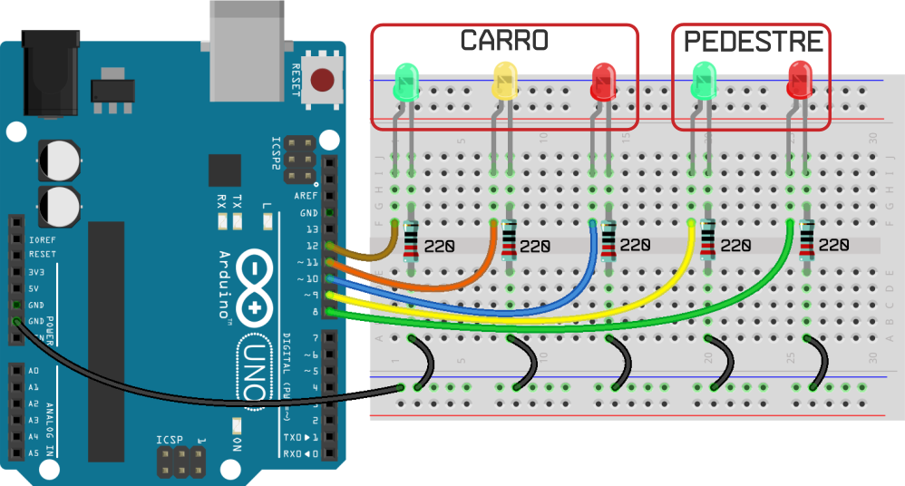

# Projeto Semáforo

## O CRÉDITO DESTE PROJETO É DO https://www.filipeflop.com/universidade/kit-maker-arduino/projeto-4-semaforo/ FOI RETIRADO APENAS PARA ESTUDO, O CRÉDITO TOTAL É DO FILIPEFLOP, INCLUSIVE DA IMAGEM DE MONTAGEM

#

## Materias necessários

* 2 LEDs Vermelho 5mm
* 2 LEDs Verde 5mm
* 1 LEDs Amarelo 5mm
* 5 Resistor 220 ohm
* 1 Protoboard
* 11 Jumper macho-macho
* 1 Cabo USB
* 1 Placa Arduino Uno

#

## Foto da montagem do circuito

